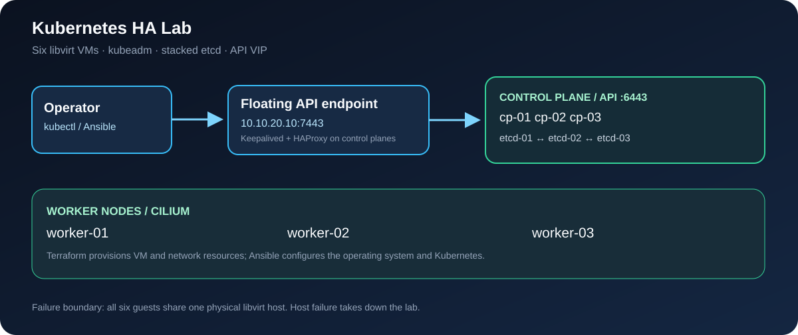

# Kubernetes HA Lab

 

A kubeadm cluster-engineering lab using Terraform/libvirt and Ansible. It provisions three control-plane VMs with stacked etcd, three worker VMs, a floating API endpoint, containerd and Cilium.



## Architecture and failure boundary

| Component | Configuration | Intended result |
|---|---|---|
| API endpoint | Keepalived VIP `10.10.20.10:7443` with HAProxy on each control plane | API traffic reaches a healthy server on `6443` |
| Control plane | Three kubeadm members with local etcd | One failed member retains etcd quorum |
| Workers | Three separately provisioned VMs | Replicated workloads can reschedule |
| Network | Cilium CNI | Pod and service connectivity |
| Configuration | Terraform generates cloud-init and Ansible inventory | VM addresses have a single source of truth |

All six VMs run on **one libvirt host**. This tests VM and control-plane failure, not physical-host or zone failure.

## Requirements

Linux with KVM/libvirt, a writable storage pool, an Ubuntu 24.04 cloud image at the configured path, Terraform, Ansible and SSH access to the libvirt NAT subnet. Defaults allocate 12 guest vCPUs and 15 GiB of guest RAM across six VMs, plus overhead for the host.

## Provision and configure

```bash
cd terraform
cp terraform.tfvars.example terraform.tfvars
# Set ssh_public_key to your public key; adjust pool, image and network as needed.
terraform init
terraform fmt -check -recursive
terraform validate
terraform apply
cd ..

export KEEPALIVED_AUTH_PASS=$(openssl rand -hex 4)
ansible-galaxy collection install -r requirements.yml
ansible-playbook -i inventory/generated-hosts.yml playbooks/site.yml
```

Keep the shared eight-character VRRP password unchanged across reruns. `inventory/hosts.yml` is a static CI syntax fixture; deployment uses Terraform's generated inventory. HAProxy listens on VIP port `7443` to avoid colliding with local API servers on `6443`.

## Verify and operate

Copy the first control plane's `/etc/kubernetes/admin.conf` securely to the operator machine. Confirm its server endpoint points to the VIP, then run:

```bash
kubectl get nodes -o wide
kubectl -n kube-system get pods -o wide
make evidence
```

For a failure drill, create a replicated workload with a PDB, stop one control-plane VM, and record API response, etcd member health, ready nodes and recovery time. Restore the VM and confirm quorum. [Operations](docs/OPERATIONS.md) covers maintenance, upgrades and certificates. [etcd recovery](docs/ETCD-RECOVERY.md) describes an isolated snapshot/restore drill.

CI checks Terraform formatting/validation and Ansible syntax/lint. Live VM creation, VIP failover, quorum and recovery require a KVM host and have not been proved by static CI.

## Repository map

| Path | Purpose |
|---|---|
| `terraform/` | libvirt network, VM disks, cloud-init and generated inventory |
| `inventory/group_vars/` | Kubernetes, Cilium and API endpoint configuration |
| `roles/`, `playbooks/` | OS preparation, kubeadm, load balancers and joins |
| `docs/`, `scripts/` | Topology, operational procedures and evidence collection |

Licensed under [MIT](LICENSE).
